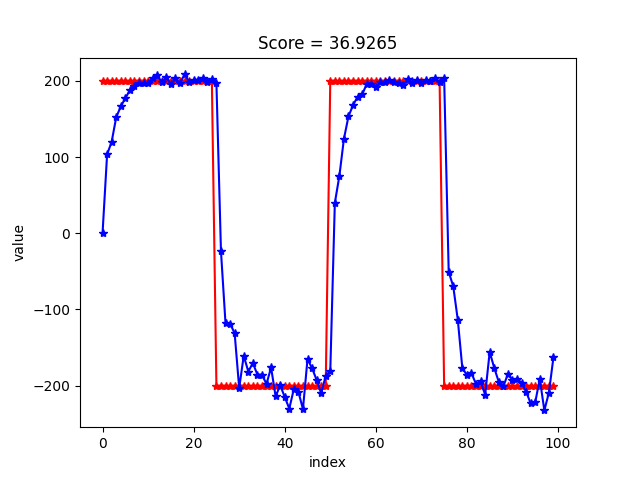

Final Project for Mechatronics

I TEST 28.4.10 question 5
CONTROL GAINS: 
Kp_mA = 0.03 %/mA
Ki_mA = 0.05 %/mA

CUBIC 28.4.12 QUESTION 5 
VALUES: 
Kp_pos = 8.0 dg/mA
Ki_pos = 0.01 mA/deg s
Kd_pos = 1750.0 mA s/deg

