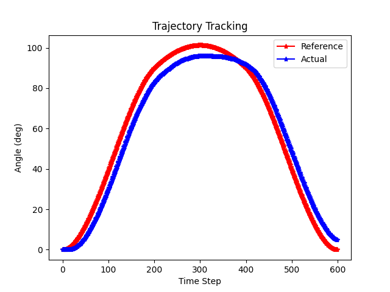
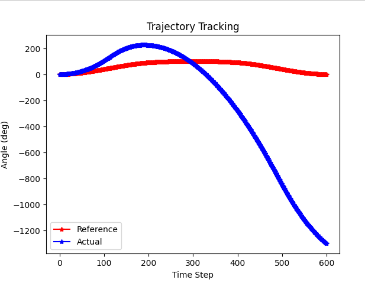
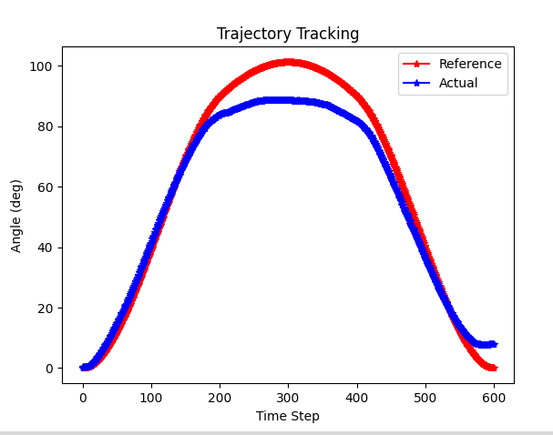

Final Project for Mechatronics


I TEST 28.4.10 question 5
CONTROL GAINS: 
Kp_mA = 0.03 %/mA
Ki_mA = 0.05 %/mA s


CUBIC 28.4.12 QUESTION 5 
VALUES: 
Kp_pos = 8.0 dg/mA 
Ki_pos = 0.01 mA/deg s
Kd_pos = 1750.0 mA s/deg




**Extension: Feed Forward Control**

Feed forward control is a control strategy used in systems where the controller anticipates the effect of a known disturbance or input and compensates for it before it affects the system's output. Unlike feedback control, which reacts to errors after they occur, feedforward control proactively adjusts the control input based on a model of the system and the expected disturbance.

Open-Loop Nature:
- Feedforward control is an open-loop control strategy because it does not rely on feedback (i.e., it does not measure the actual output to adjust the control input).
- Instead, it uses a model of the system to predict the required control action. 

**Feedforward Only**
```
//PID GAINS
static volatile float Kp_pos = 0.0, Ki_pos = 0.0, Kd_pos = 0.0;

//FF GAINS
float compute_feedforward_current(float desired_acceleration) {
    float ff_gain = 10.0; //tune this 
    float ff_current = ff_gain * desired_acceleration;
    return ff_current; 
```




**Feedforward with Gains**

This is the best trajectory I was able to get using my origginal PID values
```
//PID GAINS
static volatile float Kp_pos = 8.0, Ki_pos = 0.01, Kd_pos = 1750.0;

//FF GAINS
float compute_feedforward_current(float desired_acceleration) {
    float ff_gain = 10.0; //tune this 
    float ff_current = ff_gain * desired_acceleration;
    return ff_current; 
```



